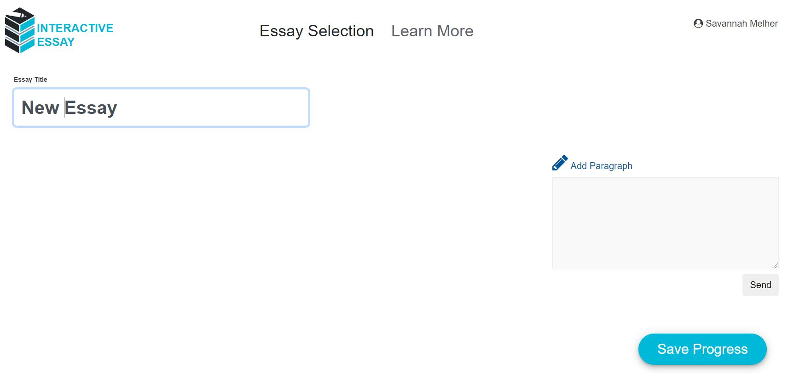
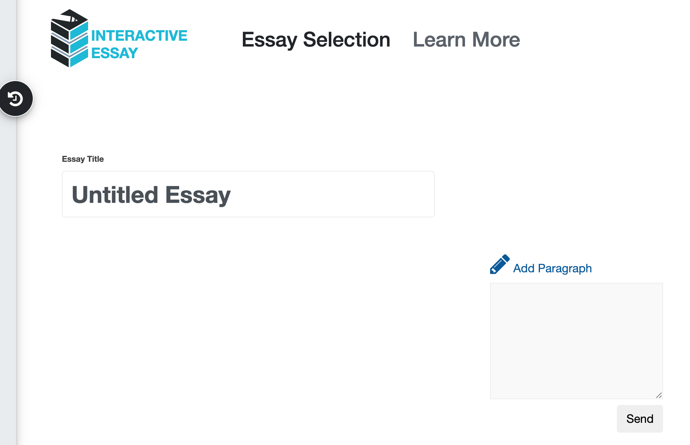
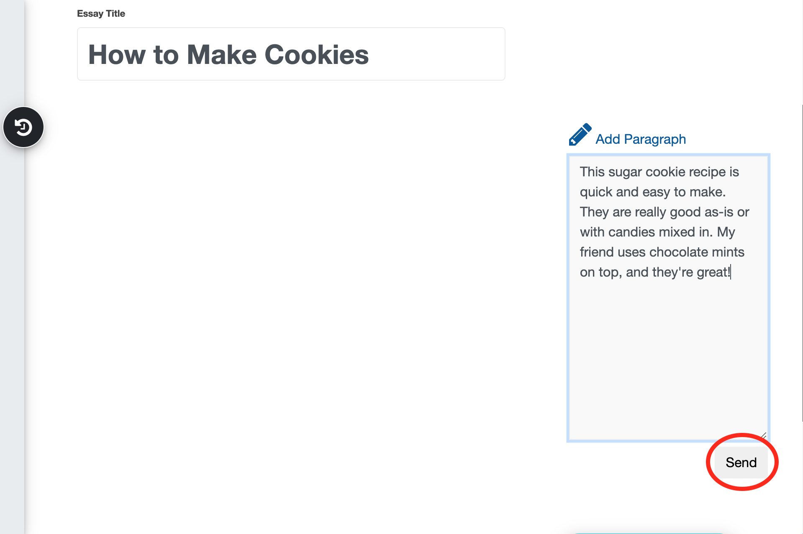
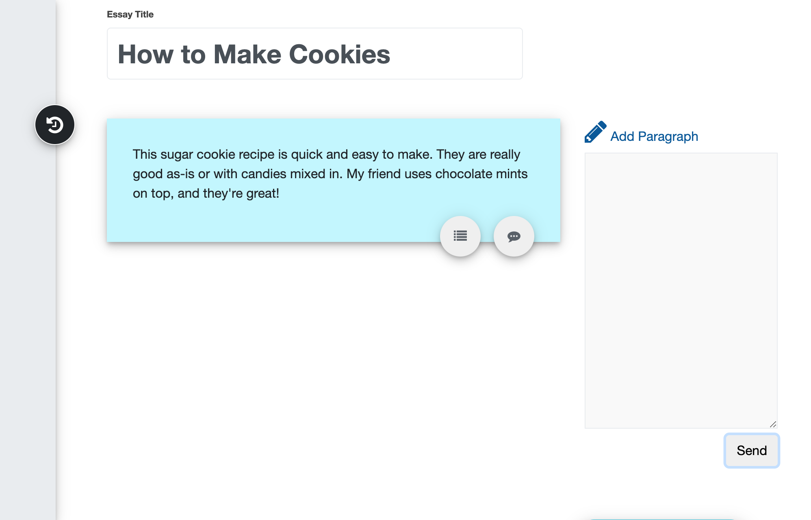
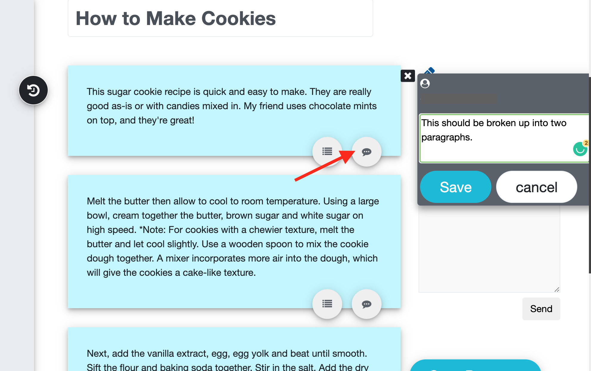
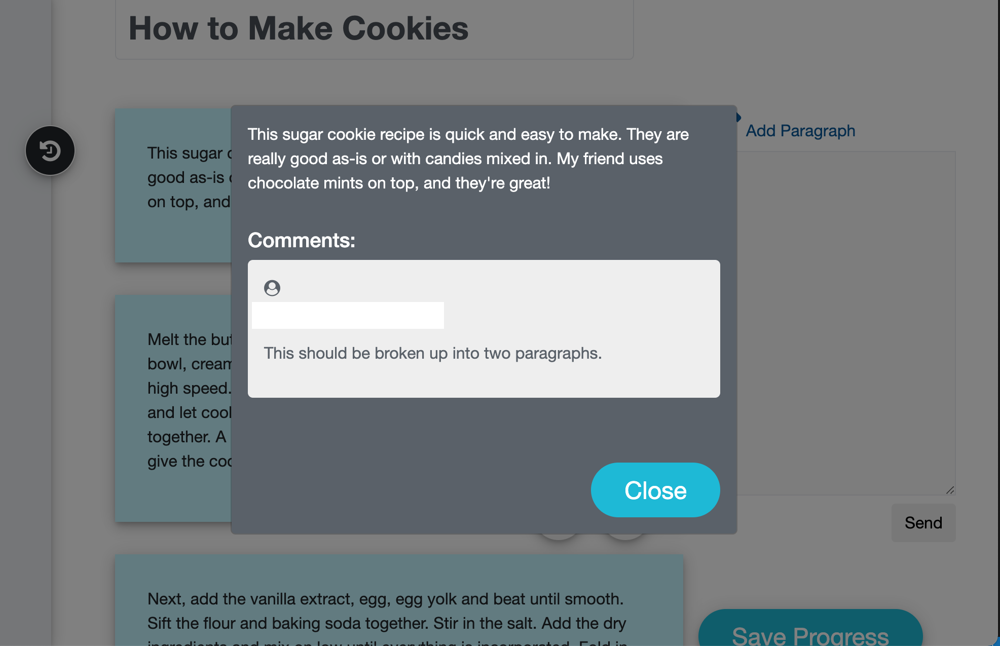
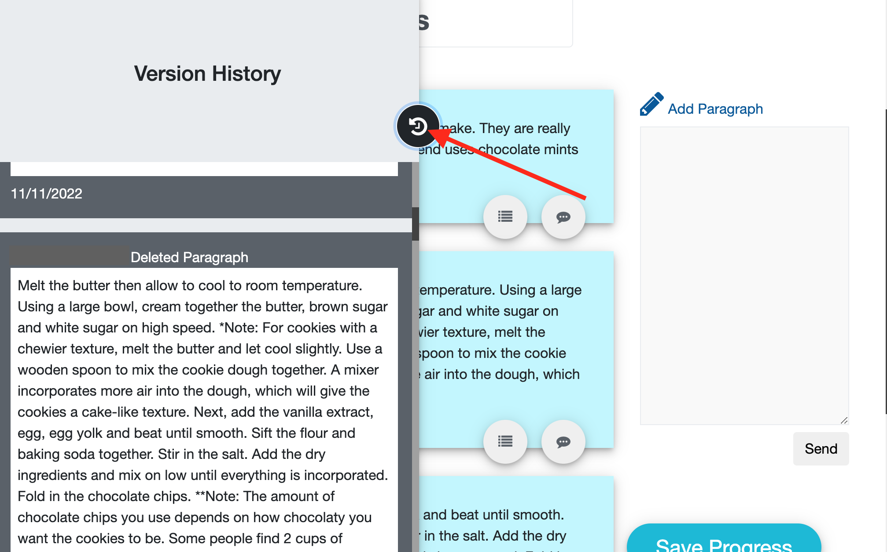
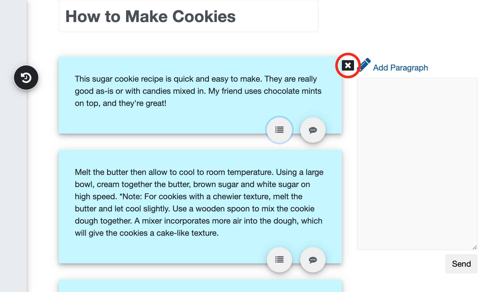

# Interactive Essay

An online tool for students to collaboratively work on an essay.

## Concept

Lecturer Shay Rahm came up with [Interactive Essay](https://cece.uco.edu/idea/EssayWriting/index.php) to improve a lecture-heavy assignment into a virtual experience.

## How It Works

### Adding a New Paragraph

<ol>

 <li>First, access the CECE Idea Teams website</li> 
 
 [Here.](https://cece.uco.edu/idea/EssayWriting/index.php)

<li>Then click the</li>

`New Essay` button.
  

- A new Essay page will open.
    
  
    

<li>

Add a name such as "How to Make Cookies"

in the `Untitled Essay` box.</li>

<li> Add the following steps to the Paragraph Section:

`This sugar cookie recipe is quick and easy to make. They are really good as-is or with candies mixed in. My friend uses chocolate mints on top, and they're great!`

</li>

<li>
Click the</li>

`Send` button under the `paragraph box`.

  

- Your essay will look like this.
    
  </li>

> Note: From here you and your team can add more paragraphs to complete the essay.

</ol>

### Commenting

<ol><li>

Leave a comment by clicking the the `comment` button.</li>

<li>Click `Save` for the changes to be submitted.</li>

<li>

Review the comment by clicking the `comment review` button.</li>

</ol>

### Viewing History

<ol>
<li>Review the version history to determine who modified the essay by clicking the black

`Version` button on the left of the screen.</li>

</ol>

**_Deleting Paragraphs_**

<ol><li>Delete a paragraph by clicking

the `black X box`.

</li>

</ol>

## Summary

Once all team members are in agreement that the essay is complete, they simply need to inform their professor that the essay is ready for review.

## Run Your Own Version

Click this link to the [repository](https://github.com/UCO-IDEA/PersuasiveSpeech) If you would like to donload and run this on your own servers.

## Documentation

<a href="https://cece.uco.edu/idea/EssayWriting/instructions/Interactive%20Essay%20Instructions.pdf" target="_blank"><b>Instructions PDF</b></a>

**Video Instructions**

- <a href="https://www.youtube.com/watch?v=kxQmrvyMGyQ&feature=youtu.be&ab_channel=CeCEIDEA" target="_blank"><b>Open an Essay</b></a>
- <a href="https://www.youtube.com/watch?v=2YKHzEabazE&feature=youtu.be&ab_channel=CeCEIDEA" target="_blank"><b>Edit an Essay</b></a>
- <a href="https://www.youtube.com/watch?v=tcqlnx59gXQ&feature=youtu.be&ab_channel=CeCEIDEA" target="_blank"><b>Communicate with your Team</b></a>
- <a href="https://www.youtube.com/watch?v=GS1y2q0y2Dc&feature=youtu.be&ab_channel=CeCEIDEA" target="_blank"><b>Save an Essay</b></a>
- <a href="https://www.youtube.com/watch?v=mnk1w3mOr0E&feature=youtu.be&ab_channel=CeCEIDEA" target="_blank"><b>Repeat and Submit</b></a>
