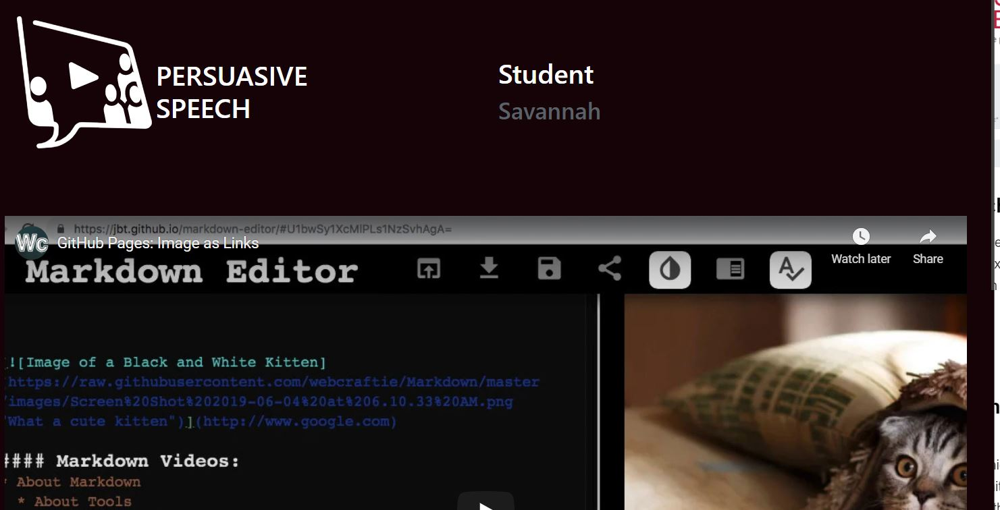

# Persuasive Speech 
This tool allows the students to upload a speech and get tangible feedback from their peers. The audience members will use a voting feature embedded into the video player to let the instructor and student speakers know how persuasive they were.

## Concept

Professor Jennifer Foster Came up with Persuasive Speech for her course by the same title, Persuasive Speech. The goal was to recreate the in person experience of giving a speech and receiving tangible feedback in a virtual environment.

## How It Works

### **Record and upload a speech**
Students record themselves giving their speech. They then upload their video to YouTube to host the video. Next they enter their YouTube link into Persuasive Speech, which will create a presenter page and an audience page.

### **View other student’s audience page**

Students visit their peers’ audience page which starts by telling them a topic and asking them to rate their initial opinion on the topic. The student watches the speech and then sees the same scale to give their final opinion on the topic.

### **View your own presenter page**
Students then visit their own presenter page to see tangible data on how persuasive their peers found their speech. Data is created by comparing initial opinions and final opinions.

## Documentation

**[Instructions PDF](https://cece.uco.edu/idea/Persuasivespeech/instructions/Persuasive%20Speech%20Instructions.pdf)**

**Video Instructions**
* [Create a Presentation](https://www.youtube.com/watch?v=xnMKVlQoLEQ&feature=youtu.be)
* [Speech Set Up](https://www.youtube.com/watch?v=vZBq4oX5ccw&feature=youtu.be)
* [Visit Classmates Videos](https://www.youtube.com/watch?v=DSrfVEPtjEs&feature=youtu.be)
* [Monitor Responses](https://www.youtube.com/watch?v=xMyM17cLEA4&feature=youtu.be)

### Process Map for Developers

### Process Map for Instructors

### Process Map for Students

